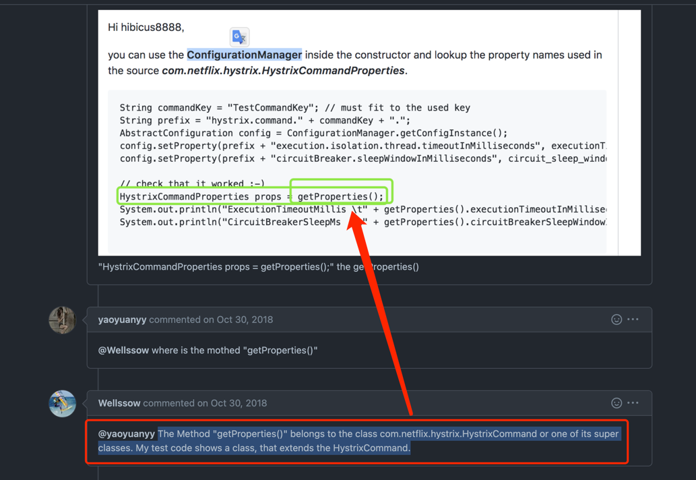

# HystrixCommand动态配置
## github
[How do I change the configuration dynamically？？？ #1717](https://github.com/Netflix/Hystrix/issues/1717) 

## hystrix 缓存 
https://blog.csdn.net/dongyuxu342719/article/details/118436136


## java
### 动态配置
```java
    MyHystrixCommand command = new MyHystrixCommand(HystrixCommandGroupKey.Factory.asKey("MyHystrixCommand"), 
        restTemplate, time);
    // 同步调用
    String execute = command.execute();
```

### 单次配置(需要重启服务才能生效)
```java
        // 
        // hystrix 缓存 https://blog.csdn.net/dongyuxu342719/article/details/118436136
        HystrixCommand.Setter hello = HystrixCommand.Setter
                .withGroupKey(HystrixCommandGroupKey.Factory.asKey("Hello"))
                .andCommandPropertiesDefaults(HystrixCommandProperties.Setter()
                        .withExecutionTimeoutInMilliseconds(time)
                        .withExecutionTimeoutEnabled(true)
                );
```


## api
```shell
curl --location --request GET 'http://127.0.0.1:8071/grape/hello?time=500'
```

